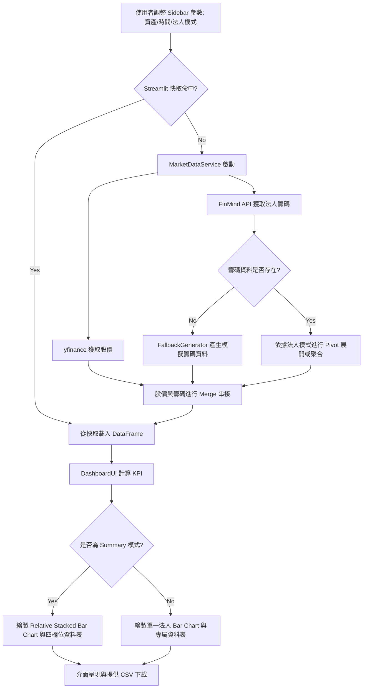

# Taiwan Stock & Institutional Capital Dashboard 文件

本文件詳細說明本專案的架構、技術棧、執行流程以及目錄結構。

---

## 1. 專案概述 (Project Overview)

- **專案名稱 (Project Name):** Taiwan Stock & Institutional Capital Dashboard (台灣股市與三大法人動態追蹤儀表板)
- **功能描述 (Description):** 這是一個高度模組化且具互動性的財經數據儀表板，專注於追蹤台灣股市（包含加權指數與所有上市個股）過去 6 個月內的每日收盤價，並與三大法人（外資、投信、自營商）的每日淨買賣超進行交叉比對與視覺化呈現。
- **系統能力 (Capabilities):**
  - **多元法人籌碼追蹤**：除了外資外，更支援「投信」、「自營商」、「三大法人合計」以及能同時在一張圖上顯示三者的「綜合比較 (Summary)」模式（以累加柱狀圖疊加呈現）。
  - **動態自訂資產支援**：使用者不僅能點選預設的權值股，亦能手動輸入自訂的台灣股票代碼（如 `2303`、`2409.TW`），系統會自動標準化符號。
  - **自動化時間與容錯機制**：自動計算回推 6 個月的資料區間，且具備 API Rate-Limit Fallback 防禦機制，當外部數據源（FinMind API）達到上限時能啟用高擬真的模擬數據生成器，防止系統崩潰。
  - **數據快取 (Caching)**：內建 `st.cache_data` 快取機制，節省 API 呼叫額度並提高頁面互動回應速度。

## 2. 系統架構與技術棧 (Architecture & Tech Stack)

本專案採用高內聚、低耦合的物件導向類別來劃分職責，將資料處理層與介面呈現層分離：

### 核心技術棧 (Tech Stack)
- **前端呈現 / 框架**: Streamlit
- **數據處理**: Pandas, NumPy
- **視覺化套件**: Plotly (支援多子圖、互動式與疊加柱狀圖)
- **數據源**: yfinance (股價)、FinMind API (三大法人籌碼)

### 模組架構 (Architecture Components)
- **`data_service.py` (業務邏輯與資料層)**
  - `AssetConfig`: 封裝資產的元數據與動態代碼解析邏輯。
  - `DataFetcher`: 負責透過 HTTP 請求 `yfinance` 與 `FinMind API` 抓取真實數據，並實作針對不同法人屬性（Foreign, Trust, Dealer）的過濾與加總邏輯。
  - `FallbackGenerator`: 產生基於股價波動的模擬數據，並為 Summary 模式按比例拆分三大法人的模擬籌碼。
  - `MarketDataService`: 作為核心協調器，統一整合股價與籌碼資料，並進行單位縮放（十億元/百萬股）。
- **`app.py` (介面與控制層)**
  - `DashboardUI`: 管理 Streamlit 介面渲染，包含側邊欄（Sidebar）、KPI 指標卡、互動式 Plotly 雙子圖（支援 Candlestick/Line 與 Relative Barmode），以及歷史數據表格的渲染與 CSV 下載。

## 3. 系統工作流與執行流程 (Workflow & Execution Flow)

本應用程式依循以下步驟處理使用者的請求：

1. **使用者觸發 (User Trigger)**
   使用者於 Sidebar 調整目標資產、時間區間或「法人分析視角 (Investor Type)」。
2. **快取檢核 (Cache Check)**
   透過 `load_market_data` 函數攔截，若傳入的參數組合在快取有效期間內，直接從 Streamlit Memory 取出 DataFrame。
3. **資料整合與過濾 (Data Fetching & Orchestration)**
   - `MarketDataService` 呼叫 `DataFetcher`。
   - `yfinance` 返回股價 DataFrame。
   - `FinMind API` 返回籌碼 DataFrame。若選擇「綜合比較 (Summary)」，程式會把外資、投信、自營商的數據抓齊並透過 DataFrame Pivot 轉換為寬資料格式（Wide format）。
4. **異常處理 (Fallback Trigger)**
   若 API 遭阻擋或回傳空值，則調用 `FallbackGenerator` 生成符合價格走勢的模擬籌碼流量。
5. **視覺化渲染 (Visual Rendering)**
   - `DashboardUI` 接收合併完畢的 DataFrame。
   - 計算最新的 KPI 變化。
   - 繪製 Plotly 圖表。若為「綜合比較 (Summary)」模式，則將下方子圖設定為 `barmode='relative'`，產生正負疊加的彩色柱狀圖，並加上「合計」的折線。
   - 將 DataFrame 匯出為可下載的 CSV，並更新資料表。

### 執行流程圖 (Flowchart)



## 4. 專案目錄結構 (Project Structure)

專案結構劃分如下（絕對路徑已進行隱蔽處理）：

```text
/path/to/project/python_TW_Stock_Foreign_Tracker/
├── .antigravity/                  # Antigravity IDE 專用 Prompt 設定檔目錄
│   ├── system.prompt
│   └── documentation.prompt       
├── app.py                         # 系統進入點與 UI 展現層 (DashboardUI)
├── data_service.py                # 業務邏輯與 API 服務層
├── requirements.txt               # 專案 Python 套件依賴清單
├── README.md                      # 使用者操作說明與簡介
└── documentation.md               # 本架構與執行文件
```

## 5. 配置與環境變數 (Configuration)

本專案將複雜設定最小化，讓使用者能開箱即用：

- **FinMind API Token (非必填):**
  - **設定方式:** 於介面 Sidebar 的 `FinMind API Token` 欄位輸入，程式會將其作為 API Request Params (`token=***`) 傳送。
  - **說明:** 未輸入時使用公用額度（每小時約 300 次）；若輸入註冊後的 API Key 則可避免遭到 Rate Limit。
- **快取有效期間 (Cache TTL):**
  - `TTL=3600`（1 小時），寫入於 `app.py` 的快取裝飾器中以避免頻繁的外部請求。
