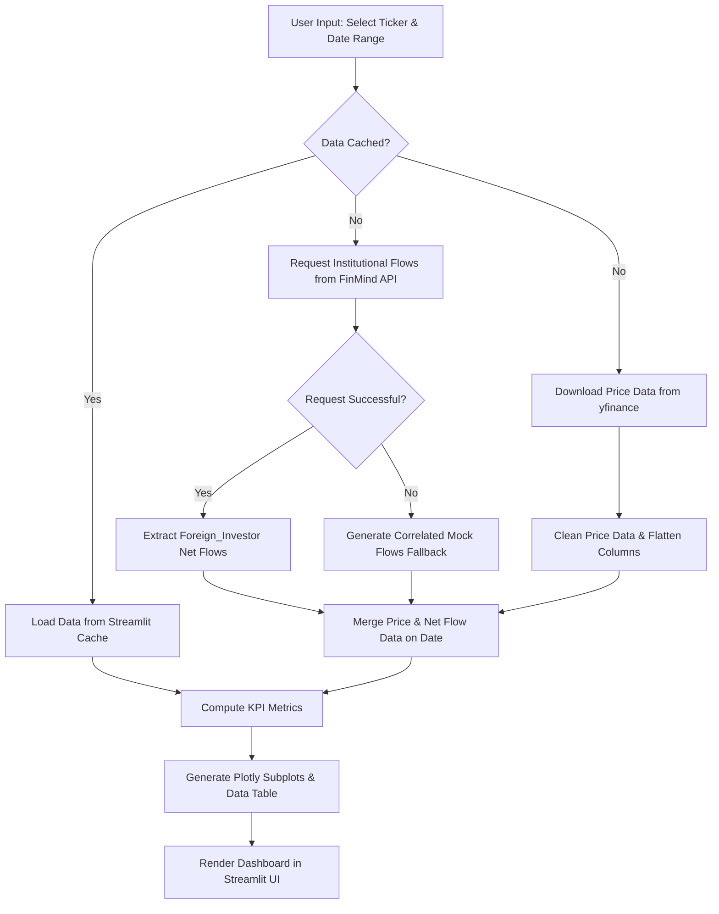

# Taiwan Stock & Foreign Institutional Tracker 專案文件

本文件詳細說明本專案的系統架構、技術棧、執行流程以及目錄結構。

---

## 1. 專案概述 (Project Overview)

- **專案名稱 (Project Name):** Taiwan Stock & Foreign Institutional Tracker
- **功能描述 (Description):** 一個專門用於追蹤與分析台灣股市加權指數（TAIEX）及前五大權值股（台積電、鴻海、聯發科、廣達、富邦金）的互動式財經數據儀表板。它能動態抓取過去 6 個月內的每日收盤價，並與外資法人（Foreign Institutional Investors）的每日淨買賣超進行交叉比對與視覺化呈現。
- **系統能力 (Capabilities):**
  - **自動化時間區間計算**：從執行當日自動向前回推整整 6 個月，且具備處理閏年與月底天數溢出的容錯處理。
  - **多來源數據整合**：整合 `yfinance` 的市場價格與 `FinMind API` 的籌碼面法人淨流入數據。
  - **互動式多維度視覺化**：支援 K 線圖（Candlestick）與折線圖（Line）的切換，並利用共享 X 軸（時間）的雙子圖（Subplots）同時對比價格與外資流向。
  - **高可用性防禦機制 (API Rate-Limit Fallback)**：當 FinMind API 達到存取上限或服務中斷時，系統能自動啟用模擬生成器，產出與價格走勢具備合理相關性的外資流向數據，防止儀表板崩潰。
  - **數據快取 (Caching)**：內建 1 小時快取機制（`st.cache_data`），節省 API 呼叫額度並提高頁面互動回應速度。

---

## 2. 架構與技術棧 (Architecture & Tech Stack)

本專案採用單一應用程式架構，前端互動介面與後端數據處理均整合於 Streamlit 框架中。

### 技術棧元件 (Tech Stack Components)
- **UI 框架 (Frontend Framework):** `Streamlit` — 快速建立互動式 Web App。
- **數據抓取 (Data Providers):**
  - `yfinance` — 取得台灣股市的歷史價格。
  - `requests` (FinMind REST API) — 取得台灣證券交易所（TWSE）三大法人買賣超數據。
- **數據分析 (Data Operations):** `pandas` — 執行 Data Cleaning、Index Alignment 與 Merge。
- **圖表引擎 (Visualization Engine):** `Plotly` — 繪製具備跨軸 Tooltip 互動功能的雙軸子圖。

---

## 3. 工作流與執行流程 (Workflow & Execution Flow)

### 執行流程說明 (Workflow Steps)
1. **使用者觸發 (User Trigger)**：使用者在 Sidebar 調整設定（如選擇股票 Ticker、切換 K 線/折線圖、縮放日期區間或輸入 API Token）。
2. **快取檢索 (Cache Check)**：系統根據輸入參數（`ticker`, `start_date`, `end_date`, `token`）檢查快取：
   - **快取命中 (Hit)**：直接載入記憶體中的 DataFrame，跳至步驟 5。
   - **快取未命中 (Miss)**：並行發起網路請求。
3. **價格數據獲取 (Price Retrieval)**：透過 `yfinance` 獲取個股的 Open, High, Low, Close, Volume。抓取後將欄位扁平化（處理 `MultiIndex`）並清理日期格式。
4. **外資數據獲取與容錯 (Flow Retrieval & Fallback)**：
   - 呼叫 FinMind API 獲取對應個股或市場整體的法人資訊。
   - 若 API 回傳 HTTP 200 成功，過濾篩選 `Foreign_Investor`，計算 `net_buy_sell = buy - sell`。
   - 若 API 回傳失敗或超出額度限制（HTTP 429/403 等），系統觸發 **Fallback 機制**：透過每日報酬率加入隨機雜訊，模擬生成與當日漲跌正相關的外資淨流入，確保圖表可正常互動。
5. **數據對齊與合併 (Data Merging)**：將價格資料與外資淨流量在 `Date` 欄位上進行 `inner join`。並根據資產類型進行數值縮放：
   - 若為加權指數（Index），外資淨流入轉換為 **十億新台幣 (NT$ Billion)**。
   - 若為個股（Stock），外資淨流入換算為 **百萬股 (Million Shares)**。
6. **KPI 指標計算 (KPI Calculation)**：計算最新收盤價、最新一日的日漲跌幅、外資當日買賣超以及歷史累積買賣超金額/股數。
7. **繪製與渲染 (Rendering)**：產生 Plotly Subplots，上方為價格走勢，下方為外資買賣超柱狀圖（正值為翠綠 `#10B981`，負值為玫瑰紅 `#F43F5E`），最後將歷史明細以 Scrollable Table 展示，並提供 CSV 下載。

### 流程圖 (Flowchart)



---

## 4. 專案目錄結構 (Project Structure)

專案結構非常精簡，符合模組化與乾淨程式碼標準：

```
/path/to/project/python_TW_Stock_Foreign_Tracker/
├── .antigravity/                  # Antigravity IDE 專用 Prompt 設定檔
│   ├── system.prompt
│   └── documentation.prompt       # 本文件產生指令 prompt
├── app.py                         # 核心應用程式程式碼 (Streamlit UI 與資料處理解析)
├── requirements.txt               # 專案 Python 套件依賴清單
├── README.md                      # 使用者操作手冊
└── documentation.md               # 專案架構與流程文件
```

---

## 5. 配置與環境變數 (Configuration)

本專案無需預先配置資料庫，但包含以下控制參數：

- **FinMind API Token (可選設定):**
  - **參數位置:** 於網頁左側 Sidebar 的 `FinMind API Token` 欄位輸入。
  - **說明:** 未輸入時，系統使用公用 API 額度（每小時約 300 次請求限制）；若欲避免 API 被限制，可免費至 FinMind 官網註冊並填入 Token，額度會提升至每小時 600 次。
- **Streamlit 埠口 (Port Config):**
  - 預設埠口為 `8501`。可於啟動命令列使用 `--server.port` 指定其他埠口。
- **快取快照時間 (Cache TTL):**
  - 程式中寫定快取生存時間為 `3600` 秒（1 小時），避免在同一小時內對同一股票重複請求相同日期的資料。
